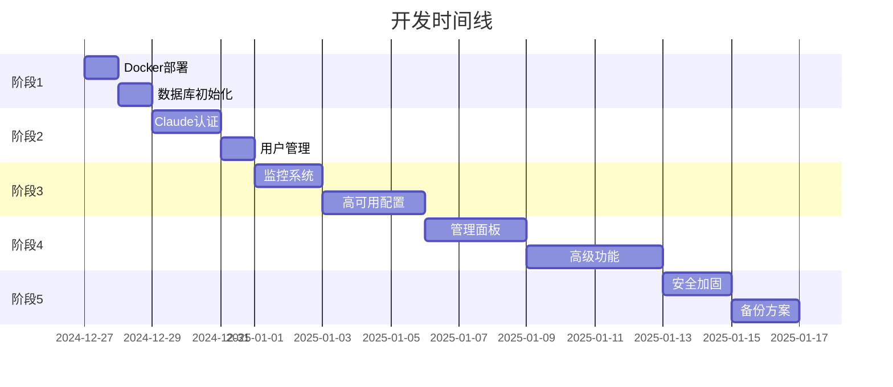

# 🎯 下一步开发计划

## 📋 当前状态总结

### ✅ 已完成
1. **基础架构**
   - ✅ Backend API 服务器 (Express.js)
   - ✅ Frontend React 界面 (Material-UI)
   - ✅ Claude CLI 集成
   - ✅ WebSocket 实时通信

2. **Docker 多账号系统**
   - ✅ 负载均衡器 (Orchestrator)
   - ✅ Worker 节点管理
   - ✅ Redis 队列系统
   - ✅ PostgreSQL 数据库架构

3. **测试覆盖**
   - ✅ 单元测试 (43个测试全部通过)
   - ✅ 集成测试
   - ✅ Mock 服务

### ⚠️ 当前问题
- 开发服务器运行在 Mock 模式
- Docker 容器未实际部署
- 缺少真实 Claude 账号配置
- 数据库连接未建立

## 🚀 优先级任务列表

### 阶段 1：部署就绪 (1-2天)

#### 1.1 启动 Docker 环境
```bash
优先级: 🔴 紧急
```
- [ ] 配置 `.env` 文件，添加真实 Claude 账号
- [ ] 启动 Docker Compose 服务
- [ ] 验证容器间通信
- [ ] 测试负载均衡

**执行步骤**:
```bash
1. cp .env.example .env
2. 编辑 .env 添加 Claude 账号信息
3. docker-compose -f docker-compose-multi-account.yml up -d
4. curl http://localhost:3000/health
```

#### 1.2 数据库初始化
```bash
优先级: 🔴 紧急
```
- [ ] 启动 PostgreSQL 容器
- [ ] 执行 init.sql 脚本
- [ ] 验证表结构创建
- [ ] 测试数据库连接

**执行步骤**:
```bash
1. docker exec -it claude-postgres psql -U claude_user -d claude_api
2. 验证表: \dt
3. 测试查询: SELECT * FROM users;
```

### 阶段 2：认证系统 (2-3天)

#### 2.1 Claude 账号认证
```bash
优先级: 🟠 高
```
- [ ] 实现 Worker 自动登录
- [ ] 处理 2FA 认证
- [ ] Token 刷新机制
- [ ] 账号状态监控

#### 2.2 用户管理系统
```bash
优先级: 🟠 高
```
- [ ] 用户注册/登录 API
- [ ] JWT Token 管理
- [ ] 权限控制 (RBAC)
- [ ] API Key 管理

### 阶段 3：生产优化 (3-5天)

#### 3.1 监控和日志
```bash
优先级: 🟡 中
```
- [ ] Prometheus 指标收集
- [ ] Grafana 仪表板
- [ ] ELK Stack 日志聚合
- [ ] 告警系统

**监控指标**:
- Worker 健康状态
- 队列深度
- 响应时间 P50/P95/P99
- 错误率
- Claude 账号使用率

#### 3.2 高可用性
```bash
优先级: 🟡 中
```
- [ ] Redis Sentinel 配置
- [ ] PostgreSQL 主从复制
- [ ] Worker 自动恢复
- [ ] 断线重连机制

### 阶段 4：功能增强 (1周)

#### 4.1 管理面板
```bash
优先级: 🟢 普通
```
- [ ] Worker 实时状态显示
- [ ] 账号使用统计
- [ ] 队列管理界面
- [ ] 系统配置管理

**界面功能**:
```javascript
// 管理面板路由
/admin/dashboard     - 总览
/admin/workers       - Worker 管理
/admin/accounts      - Claude 账号管理
/admin/queue         - 队列监控
/admin/logs          - 日志查看
```

#### 4.2 高级功能
```bash
优先级: 🟢 普通
```
- [ ] 对话历史搜索
- [ ] 导出/导入会话
- [ ] 多模型支持 (Claude 3.5 Sonnet/Opus)
- [ ] 流式响应优化
- [ ] 文件上传支持

### 阶段 5：安全加固 (3-4天)

#### 5.1 安全措施
```bash
优先级: 🔵 重要但不紧急
```
- [ ] HTTPS/TLS 配置
- [ ] API 速率限制
- [ ] DDoS 防护
- [ ] SQL 注入防护
- [ ] XSS/CSRF 防护

#### 5.2 备份恢复
```bash
优先级: 🔵 重要但不紧急
```
- [ ] 自动备份脚本
- [ ] 灾难恢复计划
- [ ] 数据加密存储
- [ ] 审计日志

## 📊 时间线



## 🎯 立即行动项

### 今天必做 (2024-12-27)

1. **启动 Docker 环境**
   ```bash
   cd "C:\Users\jiang\claude API"
   docker-compose -f docker-compose-multi-account.yml up -d
   ```

2. **验证服务状态**
   ```bash
   # 检查健康状态
   curl http://localhost:3000/health
   
   # 查看日志
   docker-compose -f docker-compose-multi-account.yml logs -f
   ```

3. **测试基本功能**
   - 访问前端: http://localhost:3030
   - 发送测试消息
   - 检查负载均衡

### 明天计划

1. **配置真实 Claude 账号**
2. **数据库连接调试**
3. **实现用户认证**

## 📚 参考资源

- [Docker Compose 文档](https://docs.docker.com/compose/)
- [Claude CLI 文档](https://claude.ai/docs/cli)
- [Redis Queue 最佳实践](https://github.com/OptimalBits/bull)
- [PostgreSQL 高可用方案](https://www.postgresql.org/docs/current/high-availability.html)

## 🤝 需要帮助的地方

1. **Claude 账号配置** - 需要提供真实的 Claude Pro 账号
2. **生产环境服务器** - 需要确定部署目标 (云服务器/本地)
3. **域名和 SSL** - 需要配置 HTTPS
4. **监控告警接收** - 需要配置告警通知渠道

## 💡 建议

基于当前进度，建议按以下顺序进行:

1. **先让系统跑起来** - 使用 Docker Compose 启动所有服务
2. **验证核心功能** - 确保 Claude CLI 能正常工作
3. **逐步完善** - 按优先级添加监控、安全等功能
4. **持续优化** - 根据使用情况调整负载均衡策略

---

**下一步**: 执行 `docker-start.bat` 启动系统！